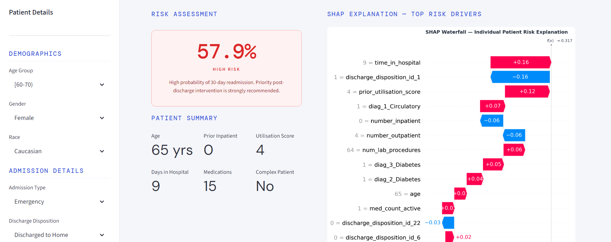

# Clinical Risk Stratification Engine

Predicting 30-day hospital readmission risk for diabetic patients — built with XGBoost, SHAP explainability, and deployed as an interactive Streamlit app.

**[Live Demo →](https://shakya658-clinical-readmission-risk-app-lwev3d.streamlit.app/)**



---

## Why I Built This

Hospital readmissions within 30 days are one of the most expensive and often preventable problems in healthcare. For diabetic patients especially, the risk factors are complex. It is not just about how sick someone is when they leave, but about their history, their medication stability, and how much support they have access to after discharge.

I wanted to build something that goes beyond just predicting a number. The goal was a tool where you could enter a patient's details and actually understand *why* the model flagged them as high risk and not just get a probability and move on. That is where the SHAP explainability piece comes in.

---

## Results

| Model | ROC AUC | PR AUC | Recall | F1 |
|-------|---------|--------|--------|----|
| Majority Class Baseline | 0.500 | 0.091 | 0.000 | 0.000 |
| Logistic Regression | 0.662 | 0.172 | 0.528 | 0.229 |
| Random Forest | 0.639 | 0.163 | 0.001 | 0.002 |
| XGBoost Tuned | **0.665** | **0.182** | **0.554** | 0.233 |
| XGBoost + Threshold Tuning | 0.665 | 0.182 | 0.429 | **0.242** |

The final model lands at ROC AUC 0.665. Published research on this exact dataset typically reports between 0.63 and 0.70, so while it did not hit my original target of 0.78, the result is consistent with what others have found. A lot of the factors that actually drive readmission (social support, whether someone has a caregiver at home, access to follow-up appointments) simply are not in this dataset.

I kept the Random Forest result in the table even though it basically never predicted the positive class. It is a useful reminder that class imbalance handling is not one-size-fits-all, the same technique that worked fine for XGBoost did not work at all for Random Forest here.

---

## Dataset

**Diabetes 130-US Hospitals for Years 1999–2008** — UCI Machine Learning Repository

101,766 patient encounters across 130 US hospitals, covering demographics, diagnoses, procedures, medications, and readmission outcomes.

**Target:** Was the patient readmitted within 30 days? (`<30` → 1, everything else → 0)

---

## Project Structure

```
clinical-readmission-risk/
├── app.py                        # Streamlit app
├── requirements.txt
├── notebooks/
│   └── 01_problem_framing.ipynb  # Full analysis — Phases 1 to 4
├── models/
│   ├── xgb_model.pkl
│   ├── scaler.pkl
│   ├── feature_names.pkl
│   └── threshold.pkl
├── plots/                        # EDA and model evaluation charts
├── data/raw/                     # Original dataset files
└── Screenshots/
```

---

## What I Did and Why

### Data Cleaning

A few decisions here that I think are worth explaining:

**Removing leaking discharge dispositions** — IDs 11, 13, 14, 19, 20, and 21 indicate the patient died, went to hospice, or was transferred somewhere where readmission is not possible. If I had left these in, the model would have learned that certain discharge codes mean readmission = 0, which is technically true but is not a clinical pattern, it is just cheating. Removed 2,423 records.

**First encounter only** — the dataset has 30,248 repeat encounters from the same patients. Keeping all of them risks the model recognising patients it has already seen during training rather than generalising. Kept only the first encounter per patient.

**Dropping high-missingness columns** — weight was missing for 97% of patients, max_glu_serum for 95%, A1Cresult for 83%. Imputing these would have meant inventing data rather than recovering it. Dropped.

Final dataset: 66,860 unique patients, 46 columns, zero missing values.

### Feature Engineering

The 23 individual medication columns were mostly empty, most patients showed "No" for most drugs. I compressed these into three derived features: how many diabetes medications the patient was actively on, how many dosage changes happened during admission, and a binary flag for insulin.

Two composite features came directly out of the EDA:
- `prior_utilisation_score` — weighted sum of prior inpatient (×3), emergency (×2), and outpatient (×1) contacts. The weights reflect the signal strength I found during analysis.
- `is_complex_patient` — flags patients on 15+ medications who also had a dosage change during admission.

ICD-9 diagnosis codes were grouped into 9 clinical categories rather than one-hot encoded raw, which would have created hundreds of near-empty columns.

### Modelling

Logistic Regression first, then Random Forest, then XGBoost tuned with Optuna. 50 trials of Bayesian hyperparameter search with 5-fold stratified cross-validation. Class imbalance (10:1) handled via `scale_pos_weight`.

The SHAP analysis confirmed what the EDA suggested, prior inpatient admissions, discharge disposition, age, and time in hospital were the strongest drivers. A patient with 5+ prior admissions has a readmission rate of 35%, compared to 8% for someone with no prior admissions. That 4x difference is the clearest signal in the entire dataset.

---

## Running Locally

```bash
git clone https://github.com/Shakya658/clinical-readmission-risk.git
cd clinical-readmission-risk
pip install -r requirements.txt
streamlit run app.py
```

Opens at `http://localhost:8501`.

---

## Tech Stack

| | |
|--|--|
| ML | XGBoost, Scikit-learn |
| Tuning | Optuna |
| Explainability | SHAP |
| Data | Pandas, NumPy |
| Visualisation | Matplotlib, Seaborn |
| App | Streamlit |

---

## About

I recently graduated with a Master of Data Science and Innovation from UTS Sydney. This project was my attempt to work through a complete end-to-end ML pipeline on a real clinical dataset, from messy raw data to a deployed, explainable application, rather than just training a model and stopping there.
The notebook documents every decision along the way, including the things that did not work.

---

*For portfolio and educational purposes only. Not for clinical use.*
