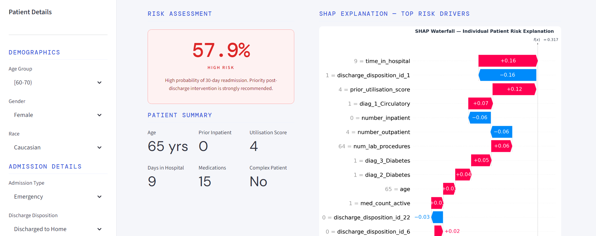

# Clinical Risk Stratification Engine

Predicting 30-day hospital readmission risk for diabetic patients using XGBoost, SHAP explainability and an interactive Streamlit application.

**[Live Demo →](https://shakya658-clinical-readmission-risk-app-lwev3d.streamlit.app/)**



> **Portfolio and educational project only. Not for clinical use.**

## Why I Built This

Hospital readmission risk is difficult to estimate because it depends on more than a patient's condition at discharge. Prior utilisation, medication changes, length of stay and post-discharge support can all matter.

The goal of this project was not only to generate a probability, but also to show why the model assigned that risk. SHAP explanations are used to surface the strongest contributing features for each prediction.

## Results

| Model | ROC AUC | PR AUC | Recall | F1 |
|---|---:|---:|---:|---:|
| Majority Class Baseline | 0.500 | 0.091 | 0.000 | 0.000 |
| Logistic Regression | 0.662 | 0.172 | 0.528 | 0.229 |
| Random Forest | 0.639 | 0.163 | 0.001 | 0.002 |
| XGBoost Tuned | **0.665** | **0.182** | **0.554** | 0.233 |
| XGBoost + Threshold Tuning | 0.665 | 0.182 | 0.429 | **0.242** |

The final model achieved a ROC AUC of **0.665**. A recent study using the same UCI dataset reported a nested cross-validated ROC AUC of **0.664** for its stacking ensemble and **0.688** after calibration, so this result is within a realistic range for structured-data readmission prediction on this dataset.

References:

- [UCI Diabetes 130-US Hospitals dataset](https://archive.ics.uci.edu/dataset/296/diabetes+130-us+hospitals+for+years+1999-2008)
- [A Machine Learning Approach for Predicting 30-Day Hospital Readmission in Patients with Diabetes](https://pubmed.ncbi.nlm.nih.gov/42121627/)

The Random Forest result is retained because it demonstrates that class-imbalance handling does not affect every model in the same way. In this experiment, the model almost never predicted the positive class.

## Dataset

**Diabetes 130-US Hospitals for Years 1999–2008** — UCI Machine Learning Repository

- 101,766 hospital encounters
- 130 US hospitals and integrated delivery networks
- Historical period: 1999–2008
- Target: readmission within 30 days
- Main file: `diabetic_data.csv`
- Supporting mapping file: `IDS_mapping.csv`

The target is encoded as:

```text
<30          → 1
NO or >30    → 0
```

The raw files are not redistributed in this repository. Dataset placement instructions are available in `data/README.md`.

## Project Structure

```text
clinical-readmission-risk/
├── app.py
├── requirements.txt
├── requirements-dev.txt
├── notebooks/
│   └── 01_problem_framing.ipynb   # End-to-end analysis and modelling workflow
├── models/
│   ├── xgb_model.pkl
│   ├── scaler.pkl
│   ├── feature_names.pkl
│   └── threshold.pkl
├── plots/
├── data/
│   ├── README.md
│   └── raw/
│       ├── diabetic_data.csv
│       └── IDS_mapping.csv
└── Screenshots/
    └── Homescreen.png
```

The notebook retains its original filename, but it contains the full workflow rather than only problem framing.

## Methodology

### Data Cleaning

#### Leakage-prone discharge categories

Only discharge-disposition categories **11, 13, 14, 19, 20 and 21** were removed. These codes represent outcomes such as death, hospice transfer or other situations where conventional readmission is not possible.

The entire `discharge_disposition_id` feature was **not** removed. Remaining clinically plausible categories were retained and could still contribute to model predictions. This is why discharge disposition can appear among the important SHAP features without contradicting the leakage-control step.

A total of 2,423 records were removed through this rule.

#### First encounter per patient

The source contains repeat encounters from the same patients. To reduce the risk of patient overlap between training and evaluation data, only the first encounter per patient was retained.

#### High-missingness fields

The following fields were dropped because their missingness was too high for reliable imputation:

- `weight`
- `max_glu_serum`
- `A1Cresult`

Final prepared dataset:

- 66,860 unique patients
- 46 pre-encoding columns, expanding to 95 predictor features after categorical encoding and feature engineering.
- Zero remaining missing values after preprocessing

### Feature Engineering

The 23 individual diabetes-medication columns were compressed into derived features including:

- Active diabetes-medication count
- Medication dosage-change count
- Insulin-use indicator

Additional features included:

- `prior_utilisation_score` — weighted combination of prior inpatient, emergency and outpatient contacts
- `is_complex_patient` — flags patients using 15 or more medications who also experienced a dosage change
- ICD-9 diagnosis categories grouped into nine broader clinical groups

### Modelling

The workflow compares:

1. Logistic Regression
2. Random Forest
3. XGBoost
4. Optuna-tuned XGBoost
5. Threshold-tuned XGBoost

The tuned XGBoost workflow uses:

- 50 Optuna trials
- Stratified five-fold cross-validation
- `scale_pos_weight` for class imbalance
- SHAP for global and local explainability

## Run the Streamlit App Locally

The app uses the committed model artefacts and does not require rerunning the notebook.

```bash
git clone https://github.com/Shakya658/clinical-readmission-risk.git
cd clinical-readmission-risk
python -m venv .venv
```

Activate the environment:

```bash
# Windows PowerShell
.venv\Scripts\Activate.ps1

# macOS or Linux
source .venv/bin/activate
```

Install the app dependencies and launch Streamlit:

```bash
pip install -r requirements.txt
streamlit run app.py
```

The application opens at `http://localhost:8501`.

## Reproduce the Analysis and Models

### 1. Download the dataset

Download the UCI dataset and place the original files here:

```text
data/raw/diabetic_data.csv
data/raw/IDS_mapping.csv
```

See `data/README.md` for the source and setup notes.

### 2. Install notebook dependencies

```bash
pip install -r requirements-dev.txt
```

### 3. Launch Jupyter

```bash
jupyter notebook
```

Open:

```text
notebooks/01_problem_framing.ipynb
```

Run the notebook from top to bottom. It documents data preparation, exploratory analysis, feature engineering, model comparison, Optuna tuning, threshold selection, evaluation and model export.

The generated artefacts used by the Streamlit app are stored in `models/`:

```text
models/xgb_model.pkl
models/scaler.pkl
models/feature_names.pkl
models/threshold.pkl
```

Because model training includes stochastic procedures, exact values can vary slightly unless all notebook random seeds and package versions are held constant.

## Dependencies

### Application

`requirements.txt` contains the packages needed to run the deployed Streamlit app.

### Notebook and development

`requirements-dev.txt` additionally includes:

- Jupyter
- Notebook
- Optuna
- Seaborn

## Tech Stack

| Area | Tools |
|---|---|
| Machine learning | XGBoost, Scikit-learn |
| Hyperparameter tuning | Optuna |
| Explainability | SHAP |
| Data processing | Pandas, NumPy |
| Visualisation | Matplotlib, Seaborn |
| Application | Streamlit |

## Limitations

- The dataset covers historical encounters from 1999–2008 and may not reflect current clinical practice.
- Important predictors such as social support, caregiver availability and access to follow-up care are unavailable.
- The model has not been externally validated on another hospital system.
- The app is a portfolio prototype and is not a medical device or clinical decision-support system.

## About

Built by **Shirish Man Shakya**, Master of Data Science and Innovation graduate from UTS Sydney.

- [Portfolio](https://shakya658.github.io/portfolio/)
- [LinkedIn](https://linkedin.com/in/shirish-man-shakya)
- [GitHub](https://github.com/Shakya658)
